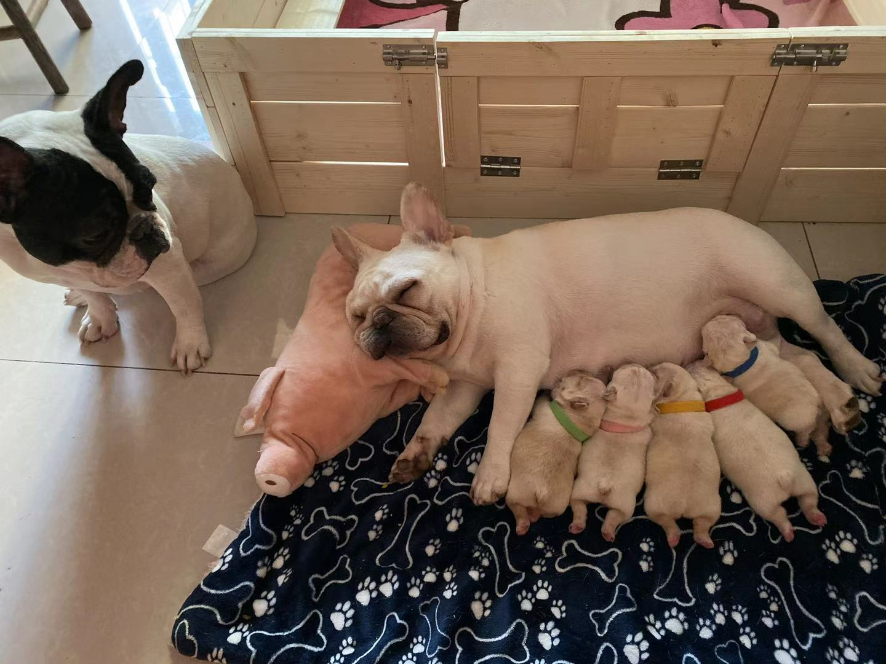

# Welcome to Ruichen Li's Github Page

## Education

### Undergraduate

**University of California, San Diego** (*UCSD*)

The expected graduate time is winter quarter 2023

### High School

**Princeton International School of Mathematics and Science** (*PRISMS*) / 2015 -> 2019

## Expertise

* Java
* R (Machine learning related)

## Experienced at

* C
* C++
* AutoCAD

## More about me

Some of my favorite songs:
* [Someone You Loved](https://www.youtube.com/watch?v=zABLecsR5UE)
* [The Nights](https://www.youtube.com/watch?v=UtF6Jej8yb4)
* [SOLO](https://www.youtube.com/watch?v=b73BI9eUkjM)

Below is a picture of my dogs

